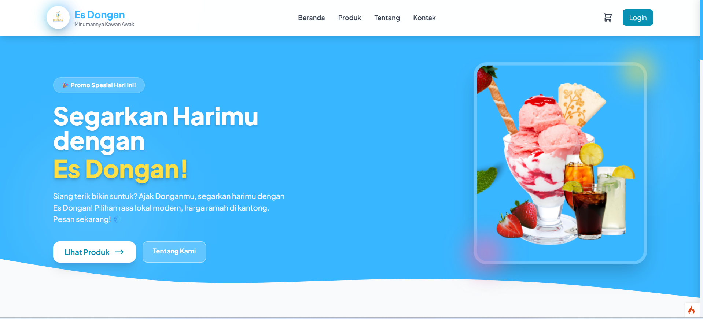
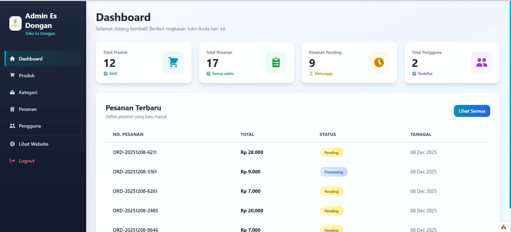

# 🥥 Web Es Dongan | E-Commerce Platform


**Web Es Dongan** adalah aplikasi *e-commerce* modern yang dirancang untuk mendigitalkan penjualan produk Es Dongan. Dibangun dengan performa tinggi menggunakan **CodeIgniter 4**, serta antarmuka yang responsif dan menarik berkat kombinasi **Tailwind CSS** (Frontend) dan **Bootstrap 5** (Admin Panel).

---

## 📸 Pratinjau (Screenshots)

| Katalog Produk | Dashboard Admin |
| :---: | :---: |
| |  |

---

## 🔥 Fitur Utama

### 🛒 Sisi Pelanggan (Frontend)
* **Modern UI/UX:** Tampilan bersih, cepat, dan *mobile-friendly* menggunakan Tailwind CSS.
* **Smart Cart:** Sistem keranjang belanja yang dinamis dan real-time.
* **Checkout System:** Alur pemesanan yang mudah dengan validasi data otomatis.
* **User Accounts:** Fitur lengkap untuk registrasi, login, dan edit profil pengguna.
* **Order History:** Pelanggan dapat memantau status pesanan mereka (Pending, Process, Done).

### 🛡️ Sisi Administrator (Backend)
* **Analytic Dashboard:** Grafik ringkasan penjualan, total produk, dan pesanan baru.
* **Product Management:** CRUD Produk (Tambah, Edit, Hapus) lengkap dengan upload gambar.
* **Order Fulfillment:** Panel admin untuk memproses status pesanan masuk.
* **User Management:** Kontrol penuh terhadap data pelanggan yang terdaftar.
* **Secure Access:** Sistem autentikasi khusus untuk keamanan halaman admin.

---

## 🛠️ Tech Stack (Teknologi)

Aplikasi ini dibangun menggunakan teknologi terkini untuk memastikan kecepatan dan kemudahan pengembangan:

* **Backend:** CodeIgniter 4 Framework (PHP 8.1+)
* **Frontend:**
    * **Tailwind CSS** (Styling Utama Halaman User)
    * **Bootstrap 5** (Komponen UI Halaman Admin)
    * JavaScript / jQuery
* **Database:** MySQL / MariaDB
* **Tools:** Composer, Git, VS Code

---

## ⚙️ Panduan Instalasi (Localhost)

Ikuti langkah-langkah berikut untuk menjalankan proyek ini di komputer Anda:

### 1. Clone Repository
Buka terminal dan clone project ini ke direktori lokal Anda:
```bash
git clone [https://github.com/heykelprayogitimantags/web-es-dongan.git](https://github.com/heykelprayogitimantags/web-es-dongan.git)
cd web-es-dongan

2. Install Dependencies
composer install

3. Konfigurasi Environment
cp env .env
Buka file .env di text editor, cari bagian database, hapus tanda pagar #, dan ubah menjadi:CI_ENVIRONMENT = development
database.default.hostname = localhost
database.default.database = db_esdongan  # Pastikan buat database ini di phpMyAdmin
database.default.username = root
database.default.password =              # Kosongkan jika default XAMPP
database.default.DBDriver = MySQLi

Tentu, ini adalah versi README.md yang lengkap dari awal sampai akhir, sudah mencakup semua request kamu (Tailwind, CodeIgniter 4, fitur lengkap, dan langkah instalasi).

Kamu tinggal Copy kode di bawah ini, lalu Paste (timpa semua isi lama) di file README.md proyek kamu.

Markdown

# 🥥 Web Es Dongan | E-Commerce Platform


**Web Es Dongan** adalah aplikasi *e-commerce* modern yang dirancang untuk mendigitalkan penjualan produk Es Dongan. Dibangun dengan performa tinggi menggunakan **CodeIgniter 4**, serta antarmuka yang responsif dan menarik berkat kombinasi **Tailwind CSS** (Frontend) dan **Bootstrap 5** (Admin Panel).

---

## 📸 Pratinjau (Screenshots)

| Katalog Produk | Dashboard Admin |
| :---: | :---: |
| *(Ganti dengan screenshot halaman depan)* | *(Ganti dengan screenshot dashboard)* |

---

## 🔥 Fitur Utama

### 🛒 Sisi Pelanggan (Frontend)
* **Modern UI/UX:** Tampilan bersih, cepat, dan *mobile-friendly* menggunakan Tailwind CSS.
* **Smart Cart:** Sistem keranjang belanja yang dinamis dan real-time.
* **Checkout System:** Alur pemesanan yang mudah dengan validasi data otomatis.
* **User Accounts:** Fitur lengkap untuk registrasi, login, dan edit profil pengguna.
* **Order History:** Pelanggan dapat memantau status pesanan mereka (Pending, Process, Done).

### 🛡️ Sisi Administrator (Backend)
* **Analytic Dashboard:** Grafik ringkasan penjualan, total produk, dan pesanan baru.
* **Product Management:** CRUD Produk (Tambah, Edit, Hapus) lengkap dengan upload gambar.
* **Order Fulfillment:** Panel admin untuk memproses status pesanan masuk.
* **User Management:** Kontrol penuh terhadap data pelanggan yang terdaftar.
* **Secure Access:** Sistem autentikasi khusus untuk keamanan halaman admin.

---

## 🛠️ Tech Stack (Teknologi)

Aplikasi ini dibangun menggunakan teknologi terkini untuk memastikan kecepatan dan kemudahan pengembangan:

* **Backend:** CodeIgniter 4 Framework (PHP 8.1+)
* **Frontend:**
    * **Tailwind CSS** (Styling Utama Halaman User)
    * **Bootstrap 5** (Komponen UI Halaman Admin)
    * JavaScript / jQuery
* **Database:** MySQL / MariaDB
* **Tools:** Composer, Git, VS Code

---

## ⚙️ Panduan Instalasi (Localhost)

Ikuti langkah-langkah berikut untuk menjalankan proyek ini di komputer Anda:

### 1. Clone Repository
Buka terminal dan clone project ini ke direktori lokal Anda:
```bash
git clone [https://github.com/heykelprayogitimantags/web-es-dongan.git](https://github.com/heykelprayogitimantags/web-es-dongan.git)
cd web-es-dongan
2. Install Dependencies
Install library PHP yang dibutuhkan oleh CodeIgniter 4 menggunakan Composer:

Bash

composer install
3. Konfigurasi Environment
Salin file konfigurasi environment dan sesuaikan dengan database lokal:

Bash

cp env .env
(Atau jika di Windows CMD: copy env .env)

Buka file .env di text editor, cari bagian database, hapus tanda pagar #, dan ubah menjadi:

Ini, TOML

CI_ENVIRONMENT = development

database.default.hostname = localhost
database.default.database = db_esdongan  # Pastikan buat database ini di phpMyAdmin
database.default.username = root
database.default.password =              # Kosongkan jika default XAMPP
database.default.DBDriver = MySQLi

4. Setup Database
# Membuat Tabel (Users, Products, Orders, Categories)
php spark migrate

# Mengisi Data Awal (Akun Admin)
php spark db:seed AdminSeeder

5.Jalankan Aplikasi
php spark serve
Buka browser dan akses alamat: http://localhost:8080

Tentu, ini adalah versi README.md yang lengkap dari awal sampai akhir, sudah mencakup semua request kamu (Tailwind, CodeIgniter 4, fitur lengkap, dan langkah instalasi).

Kamu tinggal Copy kode di bawah ini, lalu Paste (timpa semua isi lama) di file README.md proyek kamu.

Markdown

# 🥥 Web Es Dongan | E-Commerce Platform


**Web Es Dongan** adalah aplikasi *e-commerce* modern yang dirancang untuk mendigitalkan penjualan produk Es Dongan. Dibangun dengan performa tinggi menggunakan **CodeIgniter 4**, serta antarmuka yang responsif dan menarik berkat kombinasi **Tailwind CSS** (Frontend) dan **Bootstrap 5** (Admin Panel).

---

## 📸 Pratinjau (Screenshots)

| Katalog Produk | Dashboard Admin |
| :---: | :---: |
| *(Ganti dengan screenshot halaman depan)* | *(Ganti dengan screenshot dashboard)* |

---

## 🔥 Fitur Utama

### 🛒 Sisi Pelanggan (Frontend)
* **Modern UI/UX:** Tampilan bersih, cepat, dan *mobile-friendly* menggunakan Tailwind CSS.
* **Smart Cart:** Sistem keranjang belanja yang dinamis dan real-time.
* **Checkout System:** Alur pemesanan yang mudah dengan validasi data otomatis.
* **User Accounts:** Fitur lengkap untuk registrasi, login, dan edit profil pengguna.
* **Order History:** Pelanggan dapat memantau status pesanan mereka (Pending, Process, Done).

### 🛡️ Sisi Administrator (Backend)
* **Analytic Dashboard:** Grafik ringkasan penjualan, total produk, dan pesanan baru.
* **Product Management:** CRUD Produk (Tambah, Edit, Hapus) lengkap dengan upload gambar.
* **Order Fulfillment:** Panel admin untuk memproses status pesanan masuk.
* **User Management:** Kontrol penuh terhadap data pelanggan yang terdaftar.
* **Secure Access:** Sistem autentikasi khusus untuk keamanan halaman admin.

---

## 🛠️ Tech Stack (Teknologi)

Aplikasi ini dibangun menggunakan teknologi terkini untuk memastikan kecepatan dan kemudahan pengembangan:

* **Backend:** CodeIgniter 4 Framework (PHP 8.1+)
* **Frontend:**
    * **Tailwind CSS** (Styling Utama Halaman User)
    * **Bootstrap 5** (Komponen UI Halaman Admin)
    * JavaScript / jQuery
* **Database:** MySQL / MariaDB
* **Tools:** Composer, Git, VS Code

---

## ⚙️ Panduan Instalasi (Localhost)

Ikuti langkah-langkah berikut untuk menjalankan proyek ini di komputer Anda:

### 1. Clone Repository
Buka terminal dan clone project ini ke direktori lokal Anda:
```bash
git clone [https://github.com/heykelprayogitimantags/web-es-dongan.git](https://github.com/heykelprayogitimantags/web-es-dongan.git)
cd web-es-dongan
2. Install Dependencies
Install library PHP yang dibutuhkan oleh CodeIgniter 4 menggunakan Composer:

Bash

composer install
3. Konfigurasi Environment
Salin file konfigurasi environment dan sesuaikan dengan database lokal:

Bash

cp env .env
(Atau jika di Windows CMD: copy env .env)

Buka file .env di text editor, cari bagian database, hapus tanda pagar #, dan ubah menjadi:

Ini, TOML

CI_ENVIRONMENT = development

database.default.hostname = localhost
database.default.database = db_esdongan  # Pastikan buat database ini di phpMyAdmin
database.default.username = root
database.default.password =              # Kosongkan jika default XAMPP
database.default.DBDriver = MySQLi
4. Setup Database
Jalankan migrasi untuk membuat tabel dan seeder untuk data admin awal:

Bash

# Membuat Tabel (Users, Products, Orders, Categories)
php spark migrate

# Mengisi Data Awal (Akun Admin)
php spark db:seed AdminSeeder
5. Jalankan Aplikasi
Jalankan server lokal development CodeIgniter:

Bash

php spark serve
Buka browser dan akses alamat: http://localhost:8080

📂 Struktur Folder Utama
Gambaran singkat struktur folder proyek ini:
web-es-dongan/
├── app/
│   ├── Controllers/      # Logika Bisnis (Frontend & Admin)
│   ├── Database/         # File Migrasi & Seeds
│   ├── Models/           # Model Database
│   └── Views/            # Tampilan HTML (Tailwind & Bootstrap)
├── public/
│   ├── css/              # File CSS
│   ├── uploads/          # Folder penyimpanan gambar produk
│   └── index.php         # Entry point aplikasi
├── writable/             # Cache, Logs, Session
├── .env                  # Konfigurasi Environment
└── spark                 # CLI Tool CodeIgniter

## 👤 Author
**Heykel Prayogi Timanta G.s**
* GitHub: [heykelprayogitimantags](https://github.com/heykelprayogitimantags)

---
*Dibuat dengan ❤️ untuk usaha Es Dongan.*
10 Desember 2025