<div align="center">

# 🥥 Web Es Dongan
### Modern E-Commerce Platform for Traditional Beverage Business

[](https://codeigniter.com/)
[](https://php.net/)
[](https://tailwindcss.com/)
[](https://getbootstrap.com/)
[](https://mysql.com/)
[](LICENSE)

**Digitizing traditional beverage sales with modern technology**

[Features](#-key-features) • [Demo](#-demo) • [Installation](#-installation) • [Tech Stack](#-tech-stack) • [Documentation](#-project-structure)

</div>

---

## 🎯 Overview

**Web Es Dongan** is a full-featured e-commerce platform specifically designed to digitize and modernize the sales process of traditional Indonesian beverages (Es Dongan). Built with **CodeIgniter 4** framework for robust backend performance and featuring a stunning dual-frontend approach: **Tailwind CSS** for customer-facing pages and **Bootstrap 5** for the admin dashboard.

### 💡 The Vision
Transform traditional beverage businesses into the digital era while maintaining the authentic experience through:
- 🚀 Fast, responsive, and mobile-first design
- 🎨 Modern UI/UX that appeals to all age groups
- 🔒 Secure transaction and user management
- 📊 Data-driven business insights

---

## 📱 Demo

<div align="center">

### Customer Experience

<table>
<tr>
<td align="center" width="50%">
<br/>
<strong>🛍️ Product Catalog</strong><br/>
<sub>Modern grid layout with Tailwind CSS</sub>
</td>
<td align="center" width="50%">
<br/>
<strong>🛒 Smart Shopping Cart</strong><br/>
<sub>Real-time updates and calculations</sub>
</td>
</tr>
</table>

### Admin Dashboard

<table>
<tr>
<td align="center" width="50%">
<br/>
<strong>📊 Analytics Dashboard</strong><br/>
<sub>Sales overview and business metrics</sub>
</td>
<td align="center" width="50%">
<br/>
<strong>📦 Order Management</strong><br/>
<sub>Streamlined order processing workflow</sub>
</td>
</tr>
</table>

</div>

---

## 🌟 Key Features

### 🛒 Customer Portal (Frontend)

<table>
<tr>
<td width="50%">

#### Shopping Experience
- **Modern UI/UX** - Tailwind CSS-powered interface
- **Product Catalog** - Filterable and searchable products
- **Smart Cart System** - Dynamic cart with real-time updates
- **Wishlist** - Save favorite items for later
- **Quick Checkout** - Streamlined ordering process

</td>
<td width="50%">

#### User Management
- **User Registration** - Easy sign-up process
- **Secure Login** - Session-based authentication
- **Profile Management** - Edit personal information
- **Order History** - Track all past orders
- **Order Status** - Real-time order tracking (Pending/Processing/Completed)

</td>
</tr>
</table>

### 🛡️ Admin Dashboard (Backend)

<table>
<tr>
<td width="50%">

#### Business Intelligence
- **Analytics Dashboard** - Sales charts and KPIs
- **Revenue Tracking** - Daily/monthly revenue reports
- **Customer Insights** - User registration trends
- **Product Performance** - Best-selling items analysis
- **Order Statistics** - Order status breakdown

</td>
<td width="50%">

#### Management Tools
- **Product CRUD** - Complete product management
- **Image Upload** - Multi-image product gallery
- **Order Fulfillment** - Process and update order status
- **User Management** - View and manage customers
- **Category Management** - Organize products by category
- **Inventory Control** - Stock level monitoring

</td>
</tr>
</table>

---

## 🏗️ System Architecture

```mermaid
graph TB
    A[👤 Customer Browser] -->|HTTP Request| B[🌐 CodeIgniter 4 Router]
    B -->|Frontend| C[🎨 Tailwind CSS Views]
    B -->|Admin| D[🛡️ Bootstrap 5 Dashboard]
    
    C -->|AJAX/Form| E[📝 Controllers]
    D -->|AJAX/Form| E
    
    E -->|Business Logic| F[🧠 Models]
    F -->|Query| G[(🗄️ MySQL Database)]
    
    E -->|Session| H[🔐 Authentication]
    E -->|File Upload| I[📁 Public/Uploads]
    
    style A fill:#06B6D4,stroke:#fff,color:#fff
    style B fill:#EE4623,stroke:#fff,color:#fff
    style C fill:#06B6D4,stroke:#fff,color:#fff
    style D fill:#7952B3,stroke:#fff,color:#fff
    style G fill:#4479A1,stroke:#fff,color:#fff
```

<div align="center">



</div>

---

## 🛠️ Tech Stack

<div align="center">

### Backend Framework


### Frontend Technologies


### Database & Tools


</div>

### Technology Details

| Layer | Technology | Purpose |
|:---|:---|:---|
| **MVC Framework** | CodeIgniter 4.x | Backend architecture and routing |
| **Server-Side** | PHP 8.1+ | Business logic and data processing |
| **Customer UI** | Tailwind CSS 3.x | Modern, utility-first styling |
| **Admin UI** | Bootstrap 5.3 | Component-rich dashboard interface |
| **Database** | MySQL 8.0+ | Relational data storage |
| **Dependency Manager** | Composer 2.x | PHP package management |
| **Version Control** | Git | Source code management |

---

## 🚀 Installation

Follow these steps to set up the project on your local machine.

### Prerequisites

Ensure you have the following installed:

```bash
✅ PHP >= 8.1 (with required extensions)
✅ Composer >= 2.0
✅ MySQL >= 8.0 or MariaDB >= 10.3
✅ Web Server (Apache/Nginx) or PHP Built-in Server
✅ Git
```

### 📥 Step-by-Step Installation

#### 1. Clone the Repository

```bash
git clone https://github.com/heykelprayogitimantags/web-es-dongan.git
cd web-es-dongan
```

#### 2. Install PHP Dependencies

```bash
composer install
```

This will install all required CodeIgniter 4 dependencies specified in `composer.json`.

#### 3. Environment Configuration

Create environment file from template:

```bash
# Linux/Mac
cp env .env

# Windows CMD
copy env .env

# Windows PowerShell
Copy-Item env .env
```

Edit `.env` file and configure your database:

```ini
#--------------------------------------------------------------------
# ENVIRONMENT
#--------------------------------------------------------------------

CI_ENVIRONMENT = development

#--------------------------------------------------------------------
# DATABASE
#--------------------------------------------------------------------

database.default.hostname = localhost
database.default.database = db_esdongan
database.default.username = root
database.default.password = 
database.default.DBDriver = MySQLi
database.default.DBPrefix = 
database.default.port = 3306
```

#### 4. Create Database

Create a new MySQL database:

```sql
CREATE DATABASE db_esdongan CHARACTER SET utf8mb4 COLLATE utf8mb4_unicode_ci;
```

Or via phpMyAdmin:
1. Open phpMyAdmin (http://localhost/phpmyadmin)
2. Click "New" to create database
3. Name it: `db_esdongan`
4. Collation: `utf8mb4_unicode_ci`

#### 5. Run Database Migrations

Create all necessary tables:

```bash
php spark migrate
```

This will create tables for:
- ✅ users
- ✅ products
- ✅ categories
- ✅ orders
- ✅ order_items
- ✅ cart

#### 6. Seed Initial Data

Insert default admin account and sample data:

```bash
# Seed admin user
php spark db:seed AdminSeeder

# (Optional) Seed sample products
php spark db:seed ProductSeeder
```

**Default Admin Credentials:**
- Email: `admin@esdongan.com`
- Password: `admin123`

#### 7. Set Folder Permissions

Ensure writable directories have proper permissions:

```bash
# Linux/Mac
chmod -R 777 writable/
chmod -R 777 public/uploads/

# Windows (run as Administrator in PowerShell)
icacls writable /grant Everyone:F /t
icacls public\uploads /grant Everyone:F /t
```

#### 8. Start Development Server

```bash
php spark serve
```

Or specify custom host and port:

```bash
php spark serve --host=0.0.0.0 --port=8080
```

#### 9. Access the Application

Open your browser and navigate to:

- **Customer Portal:** http://localhost:8080
- **Admin Dashboard:** http://localhost:8080/admin

---

## 📂 Project Structure

```
web-es-dongan/
├── 📁 app/
│   ├── 🎮 Controllers/
│   │   ├── Home.php              # Customer homepage
│   │   ├── Product.php           # Product catalog
│   │   ├── Cart.php              # Shopping cart
│   │   ├── Checkout.php          # Order processing
│   │   ├── Auth.php              # User authentication
│   │   └── Admin/                # Admin controllers
│   │       ├── Dashboard.php     # Analytics dashboard
│   │       ├── Products.php      # Product management
│   │       ├── Orders.php        # Order fulfillment
│   │       └── Users.php         # User management
│   ├── 📊 Models/
│   │   ├── UserModel.php         # User data model
│   │   ├── ProductModel.php      # Product data model
│   │   ├── OrderModel.php        # Order data model
│   │   ├── CategoryModel.php     # Category model
│   │   └── CartModel.php         # Shopping cart model
│   ├── 🎨 Views/
│   │   ├── frontend/             # Tailwind CSS views
│   │   │   ├── layout/           # Header, footer, nav
│   │   │   ├── home.php          # Homepage
│   │   │   ├── products.php      # Product listing
│   │   │   ├── cart.php          # Cart page
│   │   │   └── checkout.php      # Checkout form
│   │   └── admin/                # Bootstrap 5 views
│   │       ├── layout/           # Admin layout
│   │       ├── dashboard.php     # Dashboard page
│   │       ├── products/         # Product CRUD views
│   │       └── orders/           # Order management
│   ├── 🗄️ Database/
│   │   ├── Migrations/           # Database schema
│   │   └── Seeds/                # Initial data
│   ├── 🔧 Config/                # Configuration files
│   ├── 🛡️ Filters/               # Request filters
│   └── 📚 Libraries/             # Custom libraries
├── 📁 public/
│   ├── 🎨 css/
│   │   ├── tailwind.css          # Tailwind styles
│   │   └── admin.css             # Admin styles
│   ├── 📜 js/
│   │   ├── app.js                # Frontend scripts
│   │   └── admin.js              # Admin scripts
│   ├── 🖼️ uploads/               # Product images
│   │   └── products/             # Product photos
│   └── 📄 index.php              # Entry point
├── 📁 writable/
│   ├── cache/                    # Cache files
│   ├── logs/                     # Application logs
│   ├── session/                  # Session data
│   └── uploads/                  # Temporary uploads
├── 📁 vendor/                    # Composer dependencies
├── 📄 .env                       # Environment config
├── 📄 composer.json              # PHP dependencies
├── 📄 spark                      # CLI tool
└── 📄 README.md                  # You are here!
```

---

## 🔧 Configuration

### Environment Variables

Key configuration options in `.env`:

```ini
# App Settings
app.baseURL = 'http://localhost:8080/'
app.indexPage = ''

# Session Settings
app.sessionDriver = 'CodeIgniter\Session\Handlers\FileHandler'
app.sessionCookieName = 'esdongan_session'
app.sessionExpiration = 7200

# Security
security.tokenName = 'csrf_token'
security.headerName = 'X-CSRF-TOKEN'
security.cookieName = 'csrf_cookie'
```

### Tailwind CSS Configuration

If you need to customize Tailwind:

```bash
# Install Node.js dependencies (if package.json exists)
npm install

# Build Tailwind CSS
npx tailwindcss -i ./public/css/input.css -o ./public/css/tailwind.css --watch
```

---

## 📊 Database Schema

### Main Tables

**users**
- id, username, email, password, full_name, phone, address, role, created_at

**products**
- id, category_id, name, description, price, stock, image, is_active, created_at

**categories**
- id, name, slug, description, created_at

**orders**
- id, user_id, order_number, total_amount, status, payment_method, shipping_address, created_at

**order_items**
- id, order_id, product_id, quantity, price, subtotal

**cart**
- id, user_id, product_id, quantity, created_at

---

## 🎯 Usage Guide

### For Customers

1. **Browse Products** - View available Es Dongan products
2. **Add to Cart** - Select quantity and add items
3. **Register/Login** - Create account or sign in
4. **Checkout** - Fill delivery details and place order
5. **Track Order** - Monitor order status in dashboard

### For Administrators

1. **Login to Admin** - Access `/admin` with credentials
2. **View Dashboard** - Check sales analytics and metrics
3. **Manage Products** - Add, edit, or remove products
4. **Process Orders** - Update order status (Pending → Processing → Completed)
5. **Manage Users** - View registered customers

---

## 🔐 Security Features

- ✅ **CSRF Protection** - Built-in CodeIgniter CSRF tokens
- ✅ **Password Hashing** - Bcrypt encryption for passwords
- ✅ **Session Management** - Secure session handling
- ✅ **Input Validation** - Server-side form validation
- ✅ **SQL Injection Prevention** - Query Builder protection
- ✅ **XSS Protection** - Output escaping by default
- ✅ **Role-Based Access** - Admin/Customer role separation

---

## 🐛 Troubleshooting

### Common Issues

**Issue 1: "Class not found" error**
```bash
# Solution: Clear cache and regenerate autoload
composer dump-autoload
php spark cache:clear
```

**Issue 2: Upload folder permission denied**
```bash
# Linux/Mac
chmod -R 777 public/uploads
chmod -R 777 writable

# Windows (Run as Admin)
icacls public\uploads /grant Everyone:F /t
```

**Issue 3: Database connection failed**
- Verify MySQL service is running
- Check database credentials in `.env`
- Ensure database `db_esdongan` exists

**Issue 4: Tailwind CSS not loading**
- Clear browser cache
- Check file path in view: `<link href="<?= base_url('css/tailwind.css') ?>">`
- Rebuild CSS if customized: `npx tailwindcss build`

---

## 🚀 Deployment

### Production Checklist

```ini
# Update .env for production
CI_ENVIRONMENT = production

# Disable debug mode
app.forceGlobalSecureRequests = true

# Update base URL
app.baseURL = 'https://yourdomain.com/'
```

### Optimization

```bash
# Optimize Composer autoload
composer install --optimize-autoloader --no-dev

# Clear and warm cache
php spark cache:clear
php spark route:list
```

---

## 🤝 Contributing

Contributions are welcome! Please follow these steps:

1. Fork the repository
2. Create feature branch (`git checkout -b feature/AmazingFeature`)
3. Commit changes (`git commit -m 'Add some AmazingFeature'`)
4. Push to branch (`git push origin feature/AmazingFeature`)
5. Open Pull Request

### Code Style

- Follow PSR-12 coding standards
- Use meaningful variable/function names
- Add comments for complex logic
- Write descriptive commit messages

---

## 📝 License

This project is licensed under the MIT License - see the [LICENSE](LICENSE) file for details.

---

## 👨‍💻 Author

<div align="center">

### Heykel Prayogi Timanta G.S

**Software Engineering Technology Student**  
**Politeknik Negeri Medan**

[](mailto:heykelprayogi123@gmail.com)
[](https://github.com/heykelprayogitimantags)

</div>

---

## 🙏 Acknowledgments

- **Es Dongan Business** for the opportunity to digitize operations
- **CodeIgniter Team** for the excellent PHP framework
- **Tailwind Labs** for the utility-first CSS framework
- **Bootstrap Team** for the comprehensive UI components

---

## 📞 Support

If you encounter any issues or have questions:

- 📧 Email: heykelprayogi123@gmail.com
- 🐛 Issues: [GitHub Issues](https://github.com/heykelprayogitimantags/web-es-dongan/issues)
- 💬 Discussions: [GitHub Discussions](https://github.com/heykelprayogitimantags/web-es-dongan/discussions)

---

<div align="center">

**⭐ If this project helps you, please give it a star!**

Made with ❤️ and ☕ for Es Dongan Business

*Last Updated: December 10, 2024*

</div>